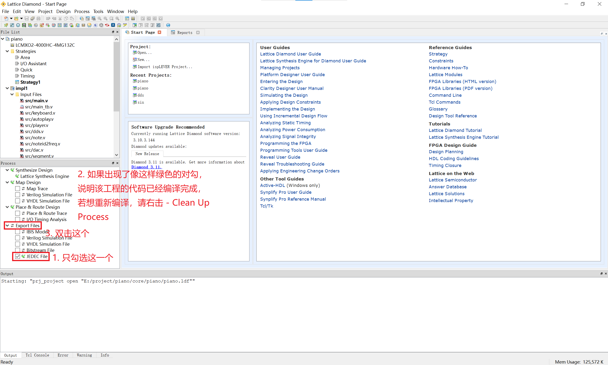

# 基于FPGA的电子琴

项目已开源在GIthub上：https://github.com/xzqiaochu/piano

## 1. 复现项目

本项目基于[电子森林](https://www.eetree.cn/)推出的**小脚丫FPGA+电子琴扩展版**，详见：https://www.eetree.cn/project/detail/1105

下图为使用我的程序后各模块的功能：


### 方法一：上传.jed文件

在这里下载最新版的.jed文件：https://github.com/xzqiaochu/piano/releases

把FPGA通过数据线连接电脑，电脑会识别到一个U盘，把.jed文件复制进去即可。

### 方法二：本地编译

1. 环境配置

   项目使用 Lattice Diamond 开发（我使用的版本为3.10.3.144），可参考这篇文章配置环境：https://www.stepfpga.com/doc/%E5%BF%AB%E9%80%9F%E4%B8%8A%E6%89%8Bstep-mxo2-c
   
2. 编译、上传

   在Github下载最新版的源代码&工程文件：https://github.com/xzqiaochu/piano/releases

   *注：建议下载release里面的，否则要重新建立工程*
   
   使用Lattice Diamond打开工程文件（.ldf为工程文件），只勾选左侧Process选项卡中的 `JEDEC File` ，然后双击 `Export Files`，编译完成后，将 `/impl`文件夹下的.jed文件上传FPGA。
   
   

​		

#### 更改歌曲的方法

代码中默认的歌曲是《always with me》，如果想更改歌曲，请参考以下步骤：

1. 准备好midi乐曲文件，工程文件的 `/python/mid` 路径下提供了几个MIDI文件，也可在这两个网站下载：
   
      - MidiShow：https://www.midishow.com/ ，缺点：大部分音乐是需要积分/收费的；
      - autopiano：https://www.autopiano.cn/ ，这是一个网页版钢琴弹奏的开源项目，进入后调出浏览器开发者工具，点开演奏示例里的文件，即可在控制台Network中抓到相应的.mid文件。
      
2. 确认MIDI文件的轨道，用可编辑MIDI文件的软件打开（例如FL Studio），找到主旋律所在的轨道编号。

      

3. 安装python环境（我使用的版本为 3.9.12），安装依赖：mido（我使用的版本为1.2.10）

4. 修改 `/python/convert.py` 的以下内容

      ```python
      MEM_FILE = "./src/music.mem" # 输出的verilog内存文件，默认位于/src/music.mem
      mid = mido.MidiFile("./python/mid/always_with_me.mid", clip=True) # midi文件路径
      select_track = 2 # 指定使用midi文件的哪个轨道
      ```

5. 运行编辑后的文件，命令行会产生如下格式的输出

   ```shell
   MUSIC_LEN: 1394
   MS_PER_BEATX64: 9
   ```

   `MUSIC_LEN` 代表总音符操作的数量（按下音符的操作次数+松开音符的操作次数）

   `MS_PER_BEATX64` 代表乐曲的速度，单位为：毫秒 / 64分之一拍

	我们需要把数值填入 `/src/autoplay.v` 的以下内容

	```verilog
	module autoplay #(parameter CLK_FREQ = 120_000_000,
	                  parameter MUSIC_LEN = 1394, // 第一处修改
	                  parameter MS_PER_BEATX64 = 9) // 第二处修改
	                 (input wire clk,
	                  input wire rst,
	                  input wire en,
	                  output reg clk_msg = 1'b0,
	                  output reg [7:0] msg = 1'b0);
	```

6. 编译、上传


## 2. 完成的功能及达到的性能

### 存储一段音乐，并可以进行音乐播放

我通过python程序解析MIDI乐曲文件，把音符信息保存在FPGA的内存中，省去了繁琐的扒谱步骤。

程序中默认储存的歌曲是《always with me》完整版，这个乐曲包含高达697个音符。


### 可以自己通过板上的按键进行弹奏，支持两个按键同时按下（和弦）并且声音不能失真，板上的按键只有13个，可以通过有上方的“上“、”下”两个按键对音程进行扩展

在储存《alway with me》的情况下，最多支持3个音符同时弹奏。这主要受限于FPGA的内部资源，算法运行任意数量的音符同时演奏。弹奏和自动演奏模式均支持和弦。下图为同时演奏1、2、3个音符时示波器捕捉到的波形：


我使用公式计算音符的频率，理论上支持任意音符进行演奏。但为了符合MIDI规范，支持127种音符的演奏（D0 - F10#）。弹奏模式下，为了避免音域过广带来的切换不便，我将范围限制在了C3 - C7这4个音阶（共49个音符）。

### 使用扬声器进行播放时，输出的音调信号除了对应于该音调的单频正弦波外，还必须包含至少一个谐波分量

我参考这篇文章：https://blog.csdn.net/u011478373/article/details/60470332 ，对钢琴音进行FFT分解后取平均，得到了模拟"钢琴音色”的基波和各次谐波之比为

```python
[1, 0.340, 0.102, 0.085, 0.070, 0.065, 0.028, 0.085, 0.011, 0.030, 0.010, 0.014, 0.012, 0.013, 0.004]
```

并以此制作了波表储存在FPGA的内存中


### 音乐的播放支持两种方式，这两种方式可以通过开关进行切换： 

1. 当开关切换到蜂鸣器端，可以通过蜂鸣器来进行音乐播放
2. 当开关切换到扬声器端，可以通过模拟扬声器来进行音乐播放，每个音符都必须包含基频 + 至少一个谐波分量


## 3. 核心代码解析

因项目的代码量较多，为了便于理解，我将代码分为3类进行分别讲解：

- 基础代码：这一类代码有点像C语言的库文件，是很多项目都会用到的功能，例如：分频器模块、除法器模块

- 核心代码：是实现本项目关键的代码，或许不同人的代码风格不一样，但都少不了对核心代码的实现。在本项目中，dds查表、PWM DAC是使钢琴发声的关键代码。

- 架构代码：这一部分的代码个人风格独特，会用到很多数据结构/算法，不同人的实现方法可能有较大的差异。

如果用一棵树结构来形容代码架构，那么基础代码是这个树最底端（根），核心代码是树的中部（树干），架构代码则是树上端（枝叶）。在开始解析代码之前，我们先来看下代码的架构图。

### 代码架构

首先对各模块的功能做下解释：

- main：最顶层模块，类似于C语言程序执行的入口
- keyboard：对钢琴按键的相关处理
- autoplay：自动演奏模块
- player：一个抽象的播放器模块，用于统筹核心模块
- segment：数码管模块，显示当前弹奏的音符
- dds：多路dds查表模块
- note：抽象的音符模块，便于管理
- dac：PWM DAC模块
- noteid2freq：音符MIDI编码转频率
- div：除法器模块
- clkdiv：分频器模块

**模块调用关系图**：每个节点表示一个模块，箭头表示调用

*注：clkdiv.v为时钟分频模块，被多个模块调用未画出*


**时钟树**：圆角矩形表示时钟信号，直角矩形表示模块；实线表示时钟倍频/分频，虚线表示时钟连接模块

*注：segment和dds模块不需要时钟*


### 基础代码

在整个程序中，我只用到了PLL的IP核（因为实在没法手写），其他部分都是手撸的。目的是减少对闭源的IP核的依赖，增强可移植性。

#### 1. 时钟分频模块（模块名：clkdiv）

时钟分频模块采用计数器实现，类似于stm32单片机TIM的实现方式。代码如下：

```verilog
module clkdiv (input wire clk,             // input clock
               input wire rst,             // active high
               input wire [31:0] divx,
               output reg clk_out = 1'b0); // clock output
    
    reg [31:0] cnt = 0;
    
    always @(posedge clk or posedge rst) begin
        if (rst) begin
            cnt     <= 1'b0;
            clk_out <= 1'b0;
        end
        else if (cnt >= (divx >> 1)) begin
            cnt <= 1'b0;
            clk_out = ~clk_out;
        end
        else begin
            cnt <= cnt + 1'b1;
        end
    end
    
endmodule
```

其中有一点需要注意：对于输出时钟 `clk_out` 电平的更改，要放在always块中进行操作，不可以用 `assign clk_out = cnt >= divx ? 1'b1 : 1'b0 ` 这样组合逻辑，因为这些写会导致 `clk_out` 完全成为一个独立的时钟，无法被全局时钟树约束。

#### 2. 除法器模块（模块名：div）

Lattice LSE 编译器似乎无法正确计算除法（Synplify 是可以计算的），百度有师傅说FPGA计算除法的时间较长，可能无法在一个时钟周期内完成，于是我就手撸了一个极其低效的除法器。

这个除法器是用减法模拟的，即用被除数不断地减去除数，直到不能再减为止。

```verilog
module div (input wire clk,
            input wire rst,
            input wire [31:0] m,
            input wire [31:0] n,
            output reg [31:0] ans);
    
    reg [31:0] last_m    = 0;
    reg [31:0] last_n    = 0;
    reg [31:0] m_cache   = 0;
    reg [31:0] n_cache   = 0;
    reg [31:0] ans_cache = 0;
    
    initial ans = 0;
    
    always @(posedge clk or posedge rst) begin
        if (rst) begin
            last_m    <= 0;
            last_n    <= 0;
            m_cache   <= 0;
            n_cache   <= 0;
            ans_cache <= 0;
            ans       <= 0;
        end
        else if (m_cache != 0) begin
            if (m_cache > n_cache) begin
                m_cache   <= m_cache - n_cache;
                ans_cache <= ans_cache + 1;
            end
            else begin
                m_cache <= 0;
                ans     <= ans_cache;
            end
        end
        else if (m != last_m || n != last_n) begin
            ans_cache <= 0;
            m_cache   <= m;
            n_cache   <= n;
            last_m    <= m;
            last_n    <= n;
        end
    end
            
endmodule
```

值得一提的是，如果除数是常量的话，可以用乘法+移位运算实现：

比如a/b，可以转化成a*(1/b)，其中1/b可以放大1024倍后再做计算，然后右移10位

### 核心代码

#### 1. dds多路查表器（模块名：dds）

我通过对钢琴音做FFT取平均，生成一个模拟钢琴音色的波形，电子琴发出不同声音时，只需要改变查表的速率即可。

项目要求电子琴要能够演奏复音，这意味着会有多路同时查询波表，需要用一个多端口ROM来实现。

我为了以后方便调整ROM的端口数，将其端口数写成了常量定义，输入输出参数就要写成这样：

```verilog
module dds #(parameter PLAYER_NUM = 3,
             parameter THETA_WIDTH = 8,
             parameter AM_WIDTH = 8)
            (input wire [THETA_WIDTH*PLAYER_NUM-1:0] theta,
             output wire [AM_WIDTH*PLAYER_NUM-1:0] am);
```

这时候会发现变量赋值不太好写，因为是个长度不确定的变量。最终用genrate块解决：

```verilog
module dds #(parameter PLAYER_NUM = 3,
             parameter THETA_WIDTH = 8,
             parameter AM_WIDTH = 8)
            (input wire [THETA_WIDTH*PLAYER_NUM-1:0] theta,
             output wire [AM_WIDTH*PLAYER_NUM-1:0] am);
    
    reg [AM_WIDTH-1:0] dds [0:(1<<THETA_WIDTH)-1];
    initial $readmemh("dds.mem", dds);
    
    genvar i;
    generate
    for (i=0; i<PLAYER_NUM; i=i+1)
        assign am[AM_WIDTH*i+:AM_WIDTH] = dds[theta[THETA_WIDTH*i+:THETA_WIDTH]];
    endgenerate
    
endmodule
```

这个模块没有时钟输入，但能够正常运行。老师说有可能是隐含了一个时钟。但我发现这个ROM不会被自动综合成EBR，如果强制综合的话，会出现复音很奇怪的情况。我猜测是默认综合成的分布式ROM能够被并行访问，而EBR只能串行访问。

#### 2. PWM DAC模块（ 模块名：dac）

小脚丫FPGA和电子琴扩展版上都没有DAC芯片，但扩展版上有个低通滤波器，可以使用PWM实现一个DAC：即用不同占空比的高频PWM的等效电压模拟DAC。

我曾经测量过一个D类功放的频率大约是500kHz，就用这个频率试了下，感觉效果很好。随后又试了下其他频率，发现当PWM频率低于200kHz的时候，声音质量会变得很差。

需要注意的是，如果用500kHz的PWM，需要配合上PLL倍频。因为板子是12MHz的晶振，12MHz / 500kHz = 24，如果直接用12MHz的频率驱动的话，DAC就只有24分之一的分辨率了。

```verilog
module dac #(parameter CLK_FREQ = 120_000_000,
             parameter AM_WIDTH = 8,
             parameter PWM_FREQ = 500_000)
            (input wire clk,                   // input clock
             input wire rst,                   // active high
             input wire [AM_WIDTH-1:0] am,     // input amplitude
             output reg pwm = 1'b0);           // output pwm
    
    localparam ARR = CLK_FREQ / PWM_FREQ - 1;
    
    reg [31:0] cnt = 1'b0;
    reg [31:0] ccr = 1'b0;
    
    always @(posedge clk or posedge rst) begin
        if (rst) begin
            cnt <= 1'b0;
            ccr <= 1'b0;
        end
        else begin
            if (cnt >= ARR) begin
                cnt <= 1'b0;
                ccr <= (am * ARR) >> AM_WIDTH;
            end
            else
                cnt <= cnt + 1'b1;
        end
    end
    
    always @(posedge clk or posedge rst) begin
        if (rst)
            pwm <= 1'b0;
        else
            pwm <= cnt > ccr;
        
    end
    
endmodule
```

#### 3. MIDI音符编码转频率（noteid2freq）

为了方便播放midi乐曲，各模块间的通信均采用音符的MIDI编码。MIDI编码为0~127的整数，部分编码和频率的对照表如下：


在控制发生的时候，需要根据MIDI编码获取相应的频率，转化公式参考这篇文章：https://www.jianshu.com/p/8f40844a6ff3 ，公式为：
$$ f = c0 * (\sqrt[12]{2}) ^ {noteid} $$
其中
$$ c0 \approx 8.18 Hz $$
因为涉及乘幂运算，这里我将其转化为时序逻辑完成：

```verilog
module noteid2freq(input wire clk,
                   input wire rst,
                   input wire [7:0] noteid,
                   output reg [15:0] freq = 1'b0);
    
    localparam C0X1024    = 8372;
    localparam RATIOX1024 = 1085;
    
    reg [7:0] last_noteid  = 1'b0;
    reg [7:0] noteid_cache = 1'b0;
    reg [31:0] freq_cache  = 1'b0;
    reg [15:0] i           = 1'b0;
    
    always @(posedge clk or posedge rst) begin
        if (rst) begin
            freq         = 1'b0;
            last_noteid  = 1'b0;
            noteid_cache = 1'b0;
            freq_cache   = 1'b0;
            i            = 1'b0;
        end
        else begin
            if (i == 1'b0) begin
                if (noteid != last_noteid) begin
                    if (noteid == 0)
                        freq = 1'b0;
                    else begin
                        noteid_cache = noteid;
                        freq_cache   = C0X1024;
                        i            = 1'b1;
                    end
                    last_noteid = noteid;
                end
            end
            else
            begin
                if (i <= noteid_cache) begin
                    freq_cache = (freq_cache * RATIOX1024) >> 10;
                    i          = i + 1'b1;
                end
                else begin
                    freq = freq_cache >> 10;
                    i    = 1'b0;
                end
            end
        end
    end
    
endmodule
```

值得一提的是，这里我使用了noteid_cache、freq_cache这两个变量，其实在之前的div除法模块中也用到了。目的是避免运算过程中外部输入突然变化导致的异常结果。

### 架构代码

剩下就是一些为了具体功能（弹奏、自动播放）而写项目代码；这部分代码长度较多，在此就不做具体展示了。

#### 1. 播放器模块（模块名：player）

这是一个抽象的播放器模块，它负责接收演奏指令，并把命令下达到各个核心模块。

#### 2. 音符模块（模块名：note）

这是抽象的音符模块，目的在于便于管理。我们需要同时演奏几个音符，就实例化几个音符模块即可。音符模块是可以在运行时改变的音符频率的。当播放器模块接收到打开音符指令后，会寻找一个空闲的音符模块让其播放；当播放器模块收到关闭音符指令后，会通知相关的音符模块停止播放。

#### 3. 按键处理模块（模块名：keyboard）、自动演奏模块（模块名：autoplay）

按键处理模块通过定时扫描模块检测按键的变动（目的是消除按键的抖动），并把需要打开/停止音符的信息告诉播放器模块；

自动演奏模块是从内存中定时读取音符信息，并发送给自动播放模块。

这两个模块和音符播放器通信是采用方式是：时钟驱动的并口通信。为了使得时序得以约束，我没有直接用通信时钟驱动always块，而是在主时钟驱动的always块中检测其的变化。

### 其他代码

除了verilog代码之后，项目中还有两个python脚本：

- convert.py：解析MIDI乐曲文件，以简洁的形式保存在FPGA的内存中；

- gentable.py：生成模拟钢琴音色的波表


## 总结与展望

### 开发过程中遇到的亿些bug

1. Lattice LSE 中除法（/）算不对，解决方法：1. 用乘法近似 2. 手写除法器 3. 用Synplify编译器

2. 尽量不要使用独立于主时钟的时钟信号（例如通过比较得到的时钟），如果用其驱动always块容易出现bug

3. always块如果要些复杂逻辑的话，最好用状态机，太多的if嵌套容易出现bug。状态机变量也不要用integer，因为资源消耗太大也容易出现bug。猜测bug的主要原因是：组合逻辑过于复杂，在一个时钟周期内算不完。

4. Synplify编译器下，initial块里只能放\$readmemh/\$readmemb和Verilog force语句

   >Within an initial block, only Verilog force statements and memory \$readmemh/\$readmemb initialization statements are recognized, and all other content is ignored.

5. Sin-Cos_Table IP核的一些bug
   - 不开output reg会很影响音质（不开input reg似乎不怎么影响音质）
   - 即使不开use 1bit for signed integer，输出的也是有符号型，但幅度减半

### 可供完善的地方

主要是受限于FPGA的资源没法再加功能了。其实把手写的ROM换成IP，就可以把数据保存在EBR里了，节约Lut资源；可这样用了闭源的IP核，降低了可移植性，与我的设计的初衷违背了。

如果FPGA的资源充足的话，还想实现这些功能：

- 对音符的发声进行ADSR包络，使其听起来更像钢琴声；
- 核心板上的8个LED灯显示当前的位于第几个音阶；
- 核心板上的两个三色LED随音乐的节奏而改变颜色和亮度
- 通过拨码开关切换不同的音色
- 储存更多的乐曲
